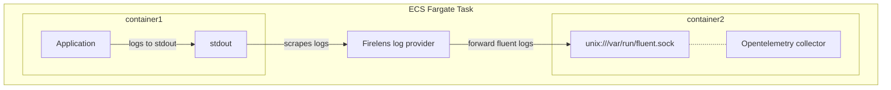

# AWS ECS (Fargate) with OpenTelemetry Collector as Firelens Receiver

> **As of know this repo just provides the config files and is not focusing how to deployt it**

This example showcase how to use the opentelemetry collector as a native firelens receiver in AWS ECS cluster (focused on `Fargate`).

Instead of spinning up a separate firelens fluentd container, we will use the opentelemetry collector and reduce the amount of overhead to run a separate container. This way we will have a unified solutions for all our logging, tracing and metrics needs.

## How it works

AWS Firelens is the log router for AWS ECSFargate. It allows you to route your logs to a destination of your choice. In this example, we will use the opentelemetry collector as a native firelens receiver. The opentelemetry collector will receive the logs and parse them

At its core `Firelens` is just sending data to `fluentd forwarder`. See also [Under the hood: Firelens for Amazon ECS tasks][firelens-uth].

## Ceveats

- AWS Distro for OpenTelemetry ([ADOT]) is missing the `fluentforward` receiver and `transform` processfor advanced body parsing
- The [AWS docs](https://docs.aws.amazon.com/AmazonECS/latest/developerguide/using_firelens.html) mention you need to listen on port `24224`, but in fact their own fluentd configuration is using the unix socket.

[ADOT]: https://github.com/aws-observability/aws-otel-collector
[firelens-uth]: https://aws.amazon.com/blogs/containers/under-the-hood-firelens-for-amazon-ecs-tasks/